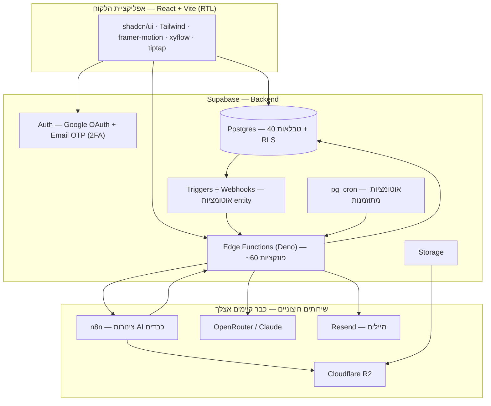

# מסמך ארכיטקטורה — שחזור iPracticom Academy ללא תלות ב-Base44

> ⚠️ **הערת גרסה (עודכן):** הוחלט סופית על **MySQL + API פנים-ארגוני** (לא Supabase
> שנשקל כאן). אנחנו בונים frontend + לוגיקה + API client (mock), וצוות הפיתוח בונה
> DB + API + auth + אחסון. **מקור-האמת הארכיטקטוני: מסמכים 36 + 37.** ה-backend
> options כאן הם היסטוריה של ההחלטה.

> **גרסה:** 1.0
> **מטרה:** (א) לעזור לך להחליט על ה-backend שיחליף את Base44, ו-(ב) לשמש כבסיס הקשר שמזינים ל-Claude Code לפני כל בנייה.
> **קלט:** מבוסס על `PRD_iPracticom_Academy.md` ו-`SRS_iPracticom_Academy.md`.

---

## 1. תקציר מנהלים

iPracticom Academy היא פלטפורמה בגודל ארגוני: 5 תחומים (LMS, KMS, Troubleshooting, גיוס, תפעול/אבטחה), ~40 ישויות, ~60 פונקציות backend, 9 אוטומציות, 5 סוכני AI, ומנוע שיעורים עם 25 סוגי בלוקים. כדי לצאת מ-Base44 **בלי להיכנס לכלוב חדש**, התחליף חייב לתת את אותן חמש השכבות ש-Base44 נותן — ורצוי בקוד פתוח/נייד.

**ההמלצה בשורה אחת:** **Supabase**. הסיבה המרכזית — שתי השכבות הכי כואבות לתרגום (הרשאות RLS ופונקציות Deno) עוברות כמעט 1:1, וזה קוד פתוח שאפשר להריץ בעצמך → אין נעילה. הפירוט המלא בסעיף 6.

---

## 2. מה Base44 נותן לנו היום — חמש השכבות

כל מערכת חלופית חייבת לכסות את חמש אלה. זה הקנה-מידה להשוואה:

1. **Auth** — Google SSO מנוהל + 2FA (OTP במייל).
2. **Database** — ישויות מבוססות-JSON עם שדות מובנים (`id`, `created_date`, `updated_date`, `created_by_id`) ו-**RLS** (הרשאות קריאה/כתיבה לפי תפקיד או בעלות).
3. **Functions** — פונקציות Deno (`Deno.serve` HTTP handlers), נקראות מהפרונט כ-`import { fn } from '@/functions/fn'`.
4. **Automations** — טריגרים על ישויות (create/update/delete) + אוטומציות מתוזמנות (cron).
5. **AI & Integrations** — `InvokeLLM`, `GenerateImage`, `SendEmail`, `UploadFile` וכו', + אינטגרציות חיצוניות (Resend, OpenRouter, n8n, Gamma, Google, Adobe).

---

## 3. הקריטריונים להחלטה — מה חשוב *לך*

לפי המטרות שהצבת והאופי של המערכת, אלה משקלי ההחלטה:

| קריטריון | למה זה קריטי כאן | משקל |
|---|---|---|
| **מניעת נעילה (lock-in)** | המטרה המוצהרת שלך — לצאת מ-Base44 ולא להיתקע שוב | גבוה מאוד |
| **מאמץ מיגרציה** | יש כבר ~60 פונקציות Deno + כללי RLS מפורטים ב-SRS. ככל שהתרגום ישיר יותר — פחות באגים | גבוה מאוד |
| **אבטחה מובנית** | יש PII של מועמדים, 2FA, whitelist, טוקנים hashed, security logs. אסור לאלתר הרשאות | גבוה |
| **התאמה ל-vibe coding** | אתה בונה דרך פרומפטים, לא כותב backend ביד. צריך פלטפורמה שנותנת מעקות בטיחות | גבוה |
| **המשכיות עם הקיים** | n8n, OpenRouter, R2 — כבר בנויים ומנופים. אסור לזרוק | בינוני-גבוה |
| **עלות בהתחלה** | פרויקט בהקמה — צריך free/hobby tier אמיתי | בינוני |
| **עתיד מובייל** | ה-PRD מציין פרסום כ-iOS/Android | בינוני |

---

## 4. המועמדים — השוואה כנה

### א. Supabase  ⭐ מומלץ
Postgres מנוהל + Auth + Storage + Edge Functions (Deno) + RLS + pg_cron. קוד פתוח, ניתן ל-self-hosting מלא.

- **בעד:** RLS של Postgres = **בדיוק** מודל ההרשאות של ה-SRS; Edge Functions רצות על **Deno — אותו runtime כמו Base44** (הפונקציות עוברות כמעט as-is); auth ל-Google + Email OTP מובנה; pg_cron לאוטומציות מתוזמנות; ניתן לייצא ל-Postgres רגיל בכל רגע (זו הנקודה שמבדילה אותו מ-Base44 — הנתונים והקוד שלך *ניידים*).
- **נגד:** הגרסה המנוהלת היא עדיין ספק (אבל ניתן לעבור ל-self-hosted בלי שינוי קוד); ל-Edge Functions יש מגבלת זמן ריצה (~רלוונטי לצינור ה-AI הארוך — אבל זה נפתר בדיוק בתבנית ה-async שכבר בנית ב-n8n, ראו §9).

### ב. Vercel + Next.js + Postgres (Neon)
שרת מלא משלך, בלי BaaS בכלל.

- **בעד:** בעלות מקסימלית — אתה מחזיק בכל שורת קוד; יש לך כבר Vercel מחובר; אין שום שכבת ספק מעל ה-DB.
- **נגד:** אתה כותב **בעצמך** את Auth, את שכבת ההרשאות שמחליפה RLS, ואת ניהול הסשנים. למערכת עם PII של מועמדים + 2FA + לוגי אבטחה — זה חבל ארוך לתלות בו את עצמך כשמתכנתים ב-vibe. יותר boilerplate, יותר החלטות, יותר משטח-תקיפה לבאגים.

### ג. נשקלו ונפסלו
- **Firebase** — חזרה לנעילה בגוגל + מודל NoSQL שלא מתאים להיררכיה היחסית (Track→Module→Topic→Lesson) ולכללי ה-JOIN של `recalculateUserStats`.
- **Appwrite / PocketBase** — BaaS קוד-פתוח קלילים, אבל פחות בשלים מ-Supabase לעומסים ול-RLS מורכב כמו שלך.

---

## 5. מיפוי 1:1 — Base44 → Supabase

זה הליבה של המסמך. לכל שכבה — מה התחליף המדויק ומה לשים לב אליו בתרגום.

### 5.1 Auth
| Base44 | Supabase | הערות תרגום |
|---|---|---|
| Google SSO מנוהל | Supabase Auth → Google OAuth provider | הגדרה בקליק בלוח הבקרה |
| 2FA (OTP במייל, `UserOtp`) | Email OTP של Supabase, או טבלת `user_otp` + edge function `verifyOtp` | אפשר לשמר את הלוגיקה הקיימת שלך אחד-לאחד |
| `User.system_role` | עמודה ב-`profiles` + JWT custom claim | ה-claim מאפשר ל-RLS לקרוא תפקיד בלי JOIN |

### 5.2 Database + שדות מובנים
| Base44 | Postgres | הערות |
|---|---|---|
| `id` (PK) | `id uuid primary key default gen_random_uuid()` | |
| `created_date` | `created_at timestamptz default now()` | |
| `updated_date` | `updated_at timestamptz` + טריגר `moddatetime` | טריגר אחד גנרי לכל הטבלאות |
| `created_by_id` (FK→User) | `created_by uuid references auth.users` | ברירת מחדל `auth.uid()` |
| ישות JSON | טבלת Postgres; שדות `object`/`array` → עמודות `jsonb` | למשל `ModuleLesson.blocks` → `jsonb` |
| enum | Postgres `enum type` או `text` + `check` | מחלקות, סטטוסים, סוגי בלוקים |

> **כלל אצבע:** כל ישות ב-SRS §1 → טבלה. שדות מקושרים (`track_id`, `topic_id`) → `uuid` + FK. שדות מבניים גמישים (`blocks`, `flow_data`, `progress_stats`, `detailed_results`) → `jsonb`.

### 5.3 RLS — שכבת ההרשאות (החלק הכי חשוב)
ה-SRS כתוב כבר בשפת RLS, אז התרגום כמעט מילולי:

| תיאור ב-SRS | מדיניות Postgres RLS |
|---|---|
| `read {}` (פתוח לכל מחובר) | `using (auth.role() = 'authenticated')` |
| `write: admin/manager/instructor` | `using ( (auth.jwt()->>'system_role') in ('admin','manager','instructor') )` |
| בעלות: `{{user.id}}` / `{{row.user_id}}` | `using ( user_id = auth.uid() )` |
| בעלות-או-מנהל (ExamAttempt) | `using ( user_id = auth.uid() or (auth.jwt()->>'system_role') in ('admin','manager') )` |

> **למה זה מנצח:** במקום לפזר בדיקות הרשאה ב-60 פונקציות (וכל פספוס = חור אבטחה), המדיניות נאכפת **ברמת ה-DB** — בדיוק כמו ב-Base44. זה ההבדל בין Supabase לבין stack מותאם, ובמערכת עם PII זה משמעותי.

### 5.4 Functions
| Base44 | Supabase | הערות |
|---|---|---|
| `Deno.serve` handler | Supabase Edge Function (Deno) | **אותו runtime** — הקוד עובר כמעט as-is |
| `auth.me()` | `supabase.auth.getUser()` מתוך הפונקציה | |
| קריאה מהפרונט `import {fn}` | `supabase.functions.invoke('fn', {...})` | עטיפה דקה בצד הלקוח משחזרת את אותו DX |
| Core: `InvokeLLM` | קריאת `fetch` ישירה ל-OpenRouter/Anthropic | אתה כבר עושה זאת ב-n8n |
| Core: `SendEmail` | קריאת Resend מתוך edge function | המפתח `Resender_SECRET` עובר כמו שהוא |
| Core: `UploadFile` / signed URLs | Supabase Storage **או** Cloudflare R2 הקיים | ה-R2 שלך נשאר; רק מחליפים את ה-SDK |

### 5.5 Automations
| Base44 | Supabase | דוגמה מהמערכת |
|---|---|---|
| טריגר entity (create) | Postgres trigger → Database Webhook → edge function | `UserProgress` create → `recalculateUserStats` |
| טריגר create/update/delete | trigger על הטבלה → ניתוב לפי `TG_OP` | `ModuleLesson` change → `onDocumentChange` (אינדוקס) |
| אוטומציה מתוזמנת | `pg_cron` job שקורא ל-edge function | `markExpiredInvites` כל שעה; `checkTrackDeadlines` 05:00 |

> **מבנה ה-payload לאוטומציות** מ-SRS (`{event, data, old_data, changed_fields}`) משוחזר ע"י Database Webhook של Supabase שמעביר `record` + `old_record` + `type`.

### 5.6 Integrations — נשארות כמעט ללא שינוי
Resend, OpenRouter, n8n, Gamma, Google OAuth, Adobe PDF — כולן נקראות מ-edge functions עם אותם מפתחות (§5 ב-SRS). R2 כבר שלך. זו שכבה שכמעט לא נוגעים בה במיגרציה.

---

## 6. ההמלצה + הנמקה

**Supabase**, מהסיבות הבאות לפי סדר חשיבות:

1. **RLS = RLS.** ה-SRS כבר מתאר הרשאות בשפת RLS. ב-Supabase זו המרה כמעט מילולית למדיניות Postgres; ב-stack מותאם זה קוד middleware שאתה כותב ובודק ידנית — סיכון מיותר במערכת עם PII ו-2FA.
2. **Deno = Deno.** ~60 הפונקציות שלך רצות על Deno גם ב-Base44 וגם ב-Supabase. זה חוסך חודש של פורט ידני.
3. **בלי נעילה אמיתית.** קוד פתוח + self-hosting + ייצוא ל-Postgres סטנדרטי. הנתונים והפונקציות שלך ניידים — זה בדיוק מה שחיפשת.
4. **מעקות בטיחות ל-vibe coding.** Auth, RLS, Storage, dashboard — מוכנים. אתה מתמקד בלוגיקה, לא בתשתית.
5. **המשכיות.** n8n + OpenRouter + R2 מתחברים ישר. הצינור הכבד נשאר ב-n8n (§9).

**מתי דווקא Vercel/Next?** רק אם בעלות מוחלטת על כל שורת קוד חשובה לך יותר מהמהירות והבטיחות — ואתה מוכן לכתוב Auth+הרשאות בעצמך. לפרופיל שלך, לא שווה את הסיכון בשלב הזה.

---

## 7. ארכיטקטורת היעד

---

## 8. השלכות על תוכן המערכת

| נכס | כמות | אופן התרגום | סיכון |
|---|---|---|---|
| ישויות | ~40 | טבלאות + jsonb + FK (מ-SRS §1) | נמוך — מכני |
| RLS | לכל ישות | מדיניות Postgres (מ-SRS §1) | נמוך — מילולי |
| פונקציות | ~60 | edge functions Deno (מ-SRS §2) | בינוני — לוגיקה לבדוק |
| אוטומציות | 9 | triggers + pg_cron (מ-SRS §3) | בינוני |
| `recalculateUserStats` | 1 קריטית | אלגוריתם מלא ב-SRS §3.1 — מתורגם ישירות | בינוני — לבדוק דה-דופ |
| מנוע בלוקים | 25 סוגים | רכיבי React + renderer לפי `editor_version` | **גבוה — החלק הקשה** |
| סוכני AI | 5 | system prompts + tool calls מול ה-DB/edge | בינוני |

> **שתי נקודות תשומת-לב שעולות מה-SRS:** (1) הערבוב במבחנים מבוסס `seed` לשחזור עקבי — לשמר את האלגוריתם. (2) טוקני הזמנה נשמרים כ-`token_hash` (SHA-256) בלבד; הטוקן הגולמי לעולם לא נשמר — לשמר בקפדנות בגיוס.

---

## 9. מה שכבר בנית — ונשאר

זה לא מתחילים מאפס. הנכסים האלה מתחברים ישר לארכיטקטורה החדשה:

- **n8n** (Quiz Maker, Flipbook, Lesson Generator) — נשאר כשכבת ה-AI הכבדה. האפליקציה החדשה קוראת לאותם webhooks.
- **תבנית ה-async שכבר פתרת** (`responseMode: onReceived`, 202, callback) — היא **בדיוק** הפתרון למגבלת זמן הריצה של Edge Functions: edge function קצרה מפעילה את n8n ומחזירה מיד; n8n עושה את העבודה הכבדה ומבצע callback ל-edge function שכותבת תוצאה. הלמידות שלך מ-Base44 עוברות כלשונן.
- **OpenRouter** (`anthropic/claude-sonnet-4.5`, `claude-opus-4-5`, FLUX) — נקרא מ-edge functions.
- **Cloudflare R2** (`guides.ip-com-academy.com`) — נשאר אחסון הקבצים.
- **מותג iPracticom** (#2EB4FF / #0075DB / RTL / footer) — עובר ל-design tokens ב-Tailwind/shadcn.

---

## 10. הצעדים הבאים אחרי ההחלטה

1. **אישור ה-stack** (המסמך הזה).
2. **סכמת DB מלאה** כמיגרציות SQL — מתוך SRS §1 (40 טבלאות + enums + FK).
3. **מדיניות RLS** לכל טבלה — מתוך הערות ה-RLS ב-SRS.
4. **handoff עיצובי** — חילוץ tokens מה-System Design ב-Claude Design ל-Tailwind config + theme.
5. **פרומפט שלב 0 ל-Claude Code** — הקמת repo, Supabase, auth, מערכת עיצוב, טבלת User.
6. משם — פרוסות אנכיות לפי מפת הדרכים (ליבת למידה → הערכה → תעודות → גיוס → KMS → troubleshooting → אדמין → AI).

---

*נספח: מקורות — `PRD_iPracticom_Academy.md` (לוגיקה עסקית), `SRS_iPracticom_Academy.md` (חוזים טכניים §1–§7).*
