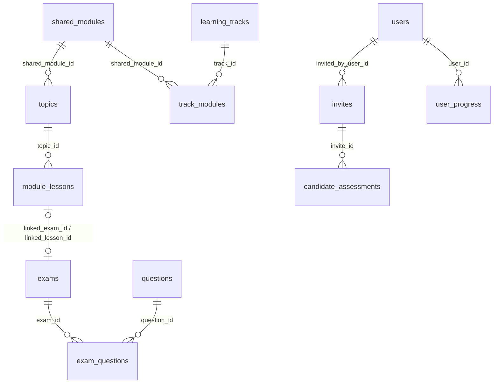
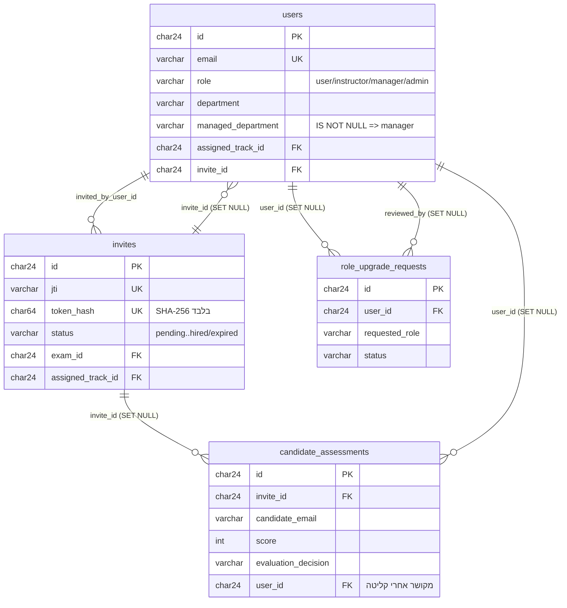
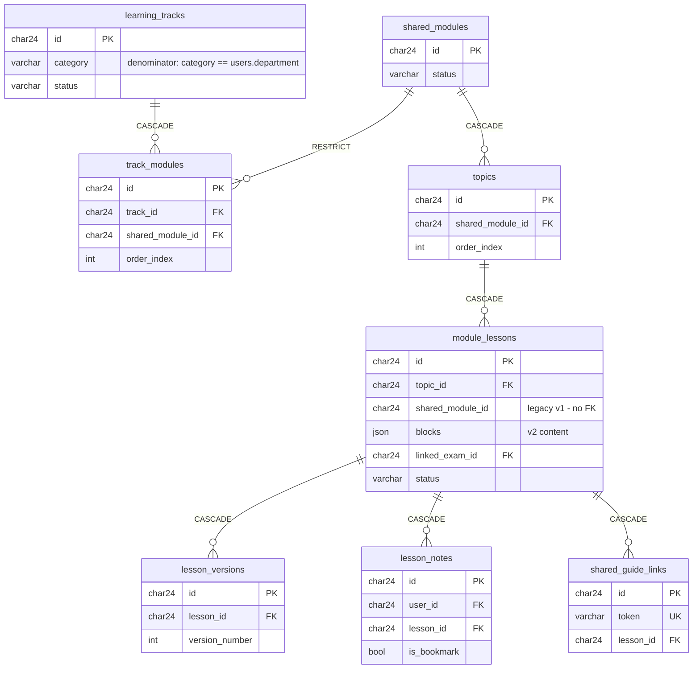
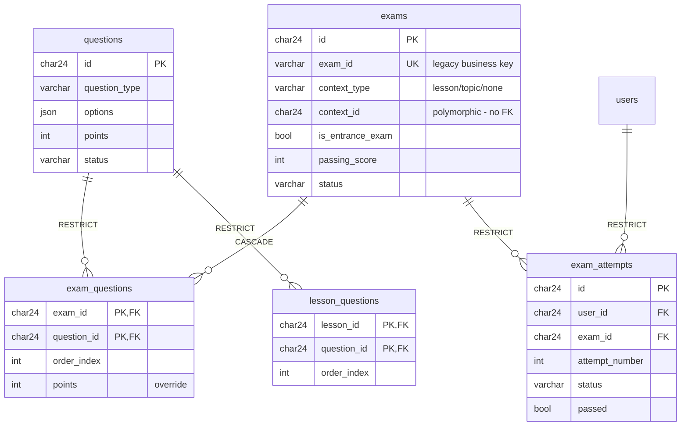
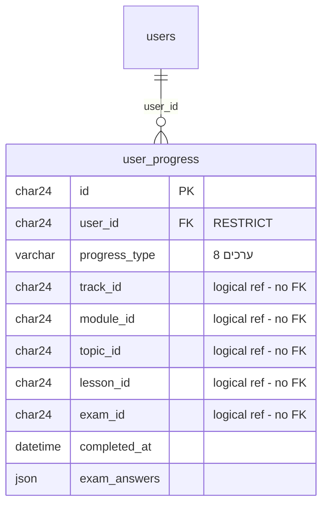
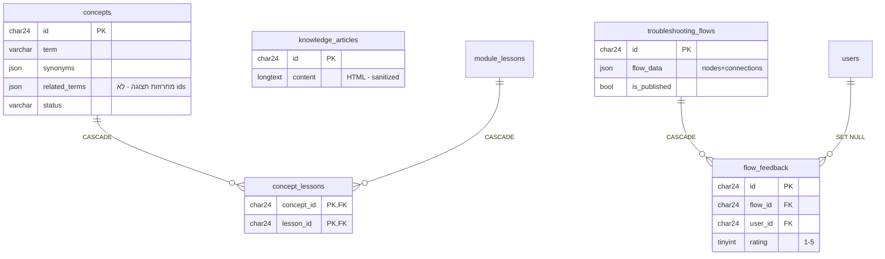
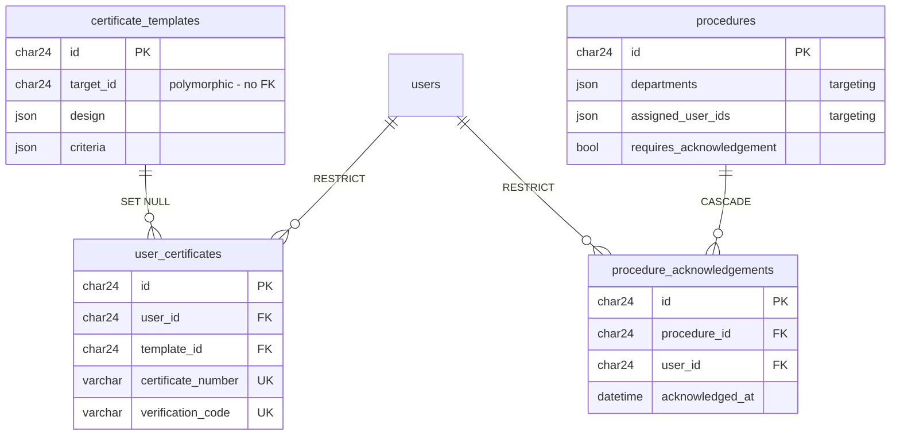
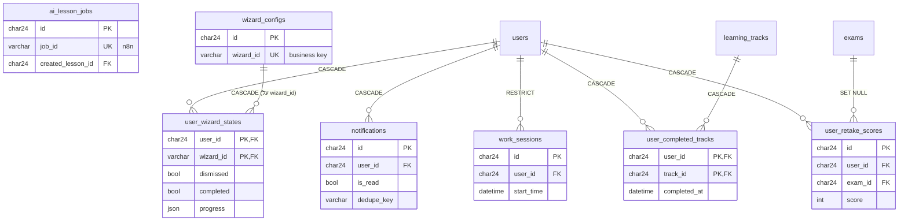

# iPracticom Academy — תרשים היחסים (RELATIONSHIPS)

> חלק מחבילת המסירה של שלב 2.2. מקור האמת: `schema/DDL_mysql.sql` (רץ ואומת מול MySQL 8.4 — 42 טבלאות, 91 מפתחות זרים, 24 אילוצי CHECK).
> המסמך נגזר מכנית מה-DDL: כל קשר בדיאגרמות מופיע גם בנספח א׳ (טבלת ה-FK המלאה, ניתנת להשוואה מול ה-DB).

## עקרונות

- **מזהים:** כל `id` הוא ה-ObjectID המקורי מ-Base44 — `CHAR(24) ascii_bin`, ללא remapping. כל עמודות ה-FK באותו טיפוס.
- **שינויי שמות (מסמך 35 §2.1):** `created_date→created_at`, `updated_date→updated_at`, `created_by_id→created_by`, `role` (לא `system_role`), `Topic.shared_module_id`, `Exam.time_limit_minutes`.
- **שלישיית audit:** `created_at`, `updated_at`, `created_by→users.id (SET NULL)` על כל טבלה (למעט `security_logs` — לוג append-only). קשרי `created_by` לא מצוירים בדיאגרמות (91−40=51 קשרים "עסקיים"); הם כן מופיעים בנספח א׳.
- **ישויות שהוסרו** (לא קיימות בסכמה): Course, ModuleExam, ExamResult, AIJob, UserOtp, SearchLog, LearningPath, GammaPresentation.

## מפת הטבלאות (42)

| דומיין | טבלאות | רשומות בגיבוי |
|---|---|---|
| A · משתמשים וגישה | users, invites, candidate_assessments, role_upgrade_requests | 21 / 56 / 10 / 2 |
| B · תוכן לימודי | learning_tracks, shared_modules, track_modules, topics, module_lessons, lesson_versions, lesson_notes, shared_guide_links | 3 / 11 / 22 / 39 / 89 / 0 / 0 / 0 |
| C · מבחנים | questions, exams, exam_attempts | 317 / 17 / 0 |
| D · התקדמות | user_progress | 5,000 |
| E · ידע | concepts, knowledge_articles, troubleshooting_flows, flow_feedback | 96 / 0 / 23 / 0 |
| F · תעודות ונהלים | certificate_templates, user_certificates, procedures, procedure_acknowledgements | 0 |
| G · AI ותפעול | ai_lesson_jobs, agent_knowledge_sources, prompt_logs, work_sessions | 0 |
| H · מערכת | app_settings, wizard_configs, notifications, changelogs, system_feedback, security_logs, content_approval_logs, assistance_requests | 6 / 17 / 0… |
| **Junctions (6)** | exam_questions, lesson_questions, concept_lessons, user_completed_tracks, user_retake_scores, user_wizard_states | נטענים מהמערכים בייבוא |

## 1. עמוד השדרה (Overview)

היררכיית הלמידה: **LearningTrack ← TrackModule → SharedModule → Topic → ModuleLesson** (מודול משותף יכול להופיע בכמה מסלולים — track_modules הוא junction קיים מהמערכת המקורית). מנוע ההתקדמות סופר את המכנה דרך השרשרת הזו: מסלולים published שבהם `category == users.department` → מודולים → נושאים → שיעורים published.

## 2. דומיין A — משתמשים, גיוס וגישה

הערות:
- **מנהל = `managed_department IS NOT NULL`**, לא `role='manager'` (מסמך 35 §6.3). הרשאות ManagerDashboard נגזרות מזה.
- `users` ↔ `invites` הוא קשר מעגלי — ב-DDL ה-FK של `users.invite_id` נוסף ב-`ALTER TABLE` בסוף הקובץ.
- שדות snapshot מכוונים (לא FK): `invites.invited_by_user_email`, `role_upgrade_requests.user_email/user_name`, `candidate_assessments.candidate_email` — שומרים זהות גם אם המשתמש נמחק.

## 3. דומיין B — תוכן לימודי

הערות:
- `track_modules` — junction עם `UNIQUE(track_id, shared_module_id)`; מחיקת מסלול מנתקת שיוכים (CASCADE), מחיקת מודול בשימוש חסומה (RESTRICT).
- `module_lessons.topic_id` הוא NULLable רק בגלל 9 שיעורי legacy v1 שתלויים ישירות על `shared_module_id` (בלי FK — 8/9 מהרפרנסים יתומים בגיבוי). אילוץ `CHECK (topic_id IS NOT NULL OR shared_module_id IS NOT NULL)` מבטיח הורה. **שיעור חדש חייב `topic_id`.**

## 4. דומיין C — מבחנים ושאלות

הערות:
- **`exam_questions` מחליף את מערך `Exam.questions`** ו**`lesson_questions` מחליף את `ModuleLesson.linked_question_ids`** (אומת: 0 יתומים, 0 כפילויות בגיבוי). RESTRICT על שאלות — אי אפשר למחוק שאלה שנמצאת בשימוש במבחן/שיעור.
- העוגן הקנוני של מבחן הוא `context_type`+`context_id` (פולימורפי — בלי FK); עמודות `linked_*_id` הן legacy שנשמר לנאמנות דאטה, עם FK ‏SET NULL.
- קשר דו-כיווני מבחן↔שיעור: `module_lessons.linked_exam_id` ↔ `exams.linked_lesson_id` (שניהם SET NULL; ה-FK של `linked_exam_id` נוסף ב-ALTER בסוף ה-DDL).

## 5. דומיין D — user_progress (יומן אירועים append-only)

**החלטה מתועדת — עמודות המימד ללא FK:** 97 אירועים בגיבוי מפנים לשיעורים שנמחקו. יומן אירועים חייב לשמר מזהים היסטוריים — ‏SET NULL היה מוחק את מפתחות הדדופ של המנוע, CASCADE היה מוחק היסטוריה (PROGRESS_ENGINE §13.2). הרפרנסים הלוגיים (בלי אכיפת FK):

| עמודה | יעד לוגי |
|---|---|
| `user_progress.track_id` | learning_tracks.id |
| `user_progress.module_id` | shared_modules.id |
| `user_progress.topic_id` | topics.id |
| `user_progress.lesson_id` | module_lessons.id |
| `user_progress.exam_id` | exams.id |

הטבלה היא **מקור האמת היחיד להתקדמות** — ה-cache הישן `User.progress_stats` לא הועבר. אין UPDATE/DELETE (ה-API מחזיר 405).

## 6. דומיין E — ידע

הערה: `concepts.related_terms` נשאר JSON **בכוונה** — בדאטה האמיתי אלו מחרוזות עבריות לתצוגה ("גלאי עשן", "DSP"), לא מזהי ישויות. `concept_lessons` הוא ה-M:N האמיתי מול שיעורים (ריק בגיבוי, מוגדר ב-SRS).

## 7. דומיין F — תעודות ונהלים

הערות: `UNIQUE(procedure_id, user_id)` — משתמש מאשר נוהל פעם אחת. מחיקת תבנית לא מבטלת תעודות שהונפקו (SET NULL). `procedures.assigned_user_ids` נשאר JSON — זו קונפיגורציית targeting, לא קשר עם מחזור חיים; הרשומה הרלציונית היא האישור (acknowledgement).

## 8. דומיינים G+H — AI, תפעול ומערכת (+ junctions של users)

לא מצוירות (קשרי `user_id`/`by_user_id` פשוטים ל-users): `system_feedback`, `content_approval_logs`, `assistance_requests` (גם ל-tracks/lessons ב-SET NULL), `ai_lesson_jobs` (ל-track/module ב-SET NULL). `security_logs`, `prompt_logs`, `app_settings`, `changelogs`, `agent_knowledge_sources` — ללא קשרים עסקיים.

## נספח א׳ — טבלת ה-FK המלאה (91 קשרים, נגזרה מ-information_schema אחרי הרצת ה-DDL)

| עמודה | יעד | ON DELETE |
|---|---|---|
| agent_knowledge_sources.created_by | users.id | SET NULL |
| ai_lesson_jobs.assigned_module_id | shared_modules.id | SET NULL |
| ai_lesson_jobs.assigned_track_id | learning_tracks.id | SET NULL |
| ai_lesson_jobs.created_by | users.id | SET NULL |
| ai_lesson_jobs.created_lesson_id | module_lessons.id | SET NULL |
| app_settings.created_by | users.id | SET NULL |
| assistance_requests.created_by | users.id | SET NULL |
| assistance_requests.lesson_id | module_lessons.id | SET NULL |
| assistance_requests.track_id | learning_tracks.id | SET NULL |
| assistance_requests.user_id | users.id | CASCADE |
| candidate_assessments.created_by | users.id | SET NULL |
| candidate_assessments.invite_id | invites.id | SET NULL |
| candidate_assessments.user_id | users.id | SET NULL |
| certificate_templates.created_by | users.id | SET NULL |
| changelogs.created_by | users.id | SET NULL |
| concept_lessons.concept_id | concepts.id | CASCADE |
| concept_lessons.lesson_id | module_lessons.id | CASCADE |
| concepts.created_by | users.id | SET NULL |
| content_approval_logs.by_user_id | users.id | SET NULL |
| content_approval_logs.created_by | users.id | SET NULL |
| exam_attempts.created_by | users.id | SET NULL |
| exam_attempts.exam_id | exams.id | RESTRICT |
| exam_attempts.user_id | users.id | RESTRICT |
| exam_questions.exam_id | exams.id | CASCADE |
| exam_questions.question_id | questions.id | RESTRICT |
| exams.created_by | users.id | SET NULL |
| exams.linked_lesson_id | module_lessons.id | SET NULL |
| exams.linked_module_id | shared_modules.id | SET NULL |
| exams.linked_topic_id | topics.id | SET NULL |
| exams.linked_track_id | learning_tracks.id | SET NULL |
| flow_feedback.created_by | users.id | SET NULL |
| flow_feedback.flow_id | troubleshooting_flows.id | CASCADE |
| flow_feedback.user_id | users.id | SET NULL |
| invites.assigned_track_id | learning_tracks.id | SET NULL |
| invites.created_by | users.id | SET NULL |
| invites.exam_id | exams.id | SET NULL |
| invites.invited_by_user_id | users.id | SET NULL |
| knowledge_articles.created_by | users.id | SET NULL |
| learning_tracks.created_by | users.id | SET NULL |
| lesson_notes.created_by | users.id | SET NULL |
| lesson_notes.lesson_id | module_lessons.id | CASCADE |
| lesson_notes.user_id | users.id | CASCADE |
| lesson_questions.lesson_id | module_lessons.id | CASCADE |
| lesson_questions.question_id | questions.id | RESTRICT |
| lesson_versions.created_by | users.id | SET NULL |
| lesson_versions.lesson_id | module_lessons.id | CASCADE |
| module_lessons.created_by | users.id | SET NULL |
| module_lessons.linked_exam_id | exams.id | SET NULL |
| module_lessons.topic_id | topics.id | CASCADE |
| notifications.created_by | users.id | SET NULL |
| notifications.user_id | users.id | CASCADE |
| procedure_acknowledgements.created_by | users.id | SET NULL |
| procedure_acknowledgements.procedure_id | procedures.id | CASCADE |
| procedure_acknowledgements.user_id | users.id | RESTRICT |
| procedures.created_by | users.id | SET NULL |
| prompt_logs.created_by | users.id | SET NULL |
| questions.created_by | users.id | SET NULL |
| role_upgrade_requests.created_by | users.id | SET NULL |
| role_upgrade_requests.reviewed_by | users.id | SET NULL |
| role_upgrade_requests.user_id | users.id | SET NULL |
| shared_guide_links.created_by | users.id | SET NULL |
| shared_guide_links.lesson_id | module_lessons.id | CASCADE |
| shared_modules.created_by | users.id | SET NULL |
| system_feedback.created_by | users.id | SET NULL |
| system_feedback.user_id | users.id | SET NULL |
| topics.created_by | users.id | SET NULL |
| topics.shared_module_id | shared_modules.id | CASCADE |
| track_modules.created_by | users.id | SET NULL |
| track_modules.shared_module_id | shared_modules.id | RESTRICT |
| track_modules.track_id | learning_tracks.id | CASCADE |
| troubleshooting_flows.created_by | users.id | SET NULL |
| user_certificates.created_by | users.id | SET NULL |
| user_certificates.template_id | certificate_templates.id | SET NULL |
| user_certificates.user_id | users.id | RESTRICT |
| user_completed_tracks.track_id | learning_tracks.id | CASCADE |
| user_completed_tracks.user_id | users.id | CASCADE |
| user_progress.created_by | users.id | SET NULL |
| user_progress.user_id | users.id | RESTRICT |
| user_retake_scores.exam_id | exams.id | SET NULL |
| user_retake_scores.user_id | users.id | CASCADE |
| user_wizard_states.user_id | users.id | CASCADE |
| user_wizard_states.wizard_id | wizard_configs.wizard_id | CASCADE |
| users.assigned_track_id | learning_tracks.id | SET NULL |
| users.created_by | users.id | SET NULL |
| users.invite_id | invites.id | SET NULL |
| users.pending_entrance_exam_id | exams.id | SET NULL |
| users.pending_retake_exam_id | exams.id | SET NULL |
| users.pending_retake_exam_invite_id | invites.id | SET NULL |
| wizard_configs.created_by | users.id | SET NULL |
| work_sessions.created_by | users.id | SET NULL |
| work_sessions.user_id | users.id | RESTRICT |

## נספח ב׳ — מיפוי מערכים → טבלאות junction (בייבוא)

| שדה מקור (Base44) | יעד | הערות |
|---|---|---|
| `Exam.questions[{question_id,order_index,points}]` | `exam_questions` | אומת: 0 יתומים, 0 כפילויות |
| `ModuleLesson.linked_question_ids[]` | `lesson_questions` | order_index = מיקום במערך |
| `Concept.related_lessons[]` | `concept_lessons` | ריק בגיבוי — junction מוכן |
| `User.completed_tracks[]` | `user_completed_tracks` | ריק בגיבוי — junction מוכן |
| `User.retake_exam_scores[{...}]` | `user_retake_scores` | surrogate id — ריטייק חוזר אפשרי |
| `User.dismissed_wizards[] / completed_wizards[] / wizard_progress{}` | `user_wizard_states` | אומת: כל ה-wizard_ids קיימים ב-wizard_configs |

**מערכים שנשארים JSON בכוונה (לא לנרמל):** tags, target_roles, target_departments, topic_tags, learning_objectives, synonyms, `related_terms` (מחרוזות תצוגה), examples, external_links, options, order_items, blocks, pages, resources, multiple_choice_questions, departments, assigned_user_ids, steps, version_history, edit_permissions, share_settings, exam_answers, question_order, answer_orders.

## נספח ג׳ — טריאז' ייבוא (חריגות שאומתו מול הגיבוי)

| בעיה | היקף | טיפול |
|---|---|---|
| `topics.shared_module_id` יתום | 9/39 נושאים (ותחתם 16 שיעורי draft + 42 אירועי progress) | ⚠ החלטה לפני ייבוא: re-parent או מחיקת תת-העץ |
| רשומת `track_modules` פגומה | 1 (שדות של מודול, בלי shared_module_id) | ⚠ תיקון/מחיקה לפני ייבוא |
| `candidate_assessments.invite_id` יתום | 3/10 | NULL (המייל שומר עקיבות) |
| `role_upgrade_requests.user_id` יתום | 2/2 | NULL (snapshots שומרים זהות) |
| `exams.linked_lesson_id` יתום | 1/12 | NULL |
| `created_by` יתום | נרחב (למשל questions ‏282/317) | NULL |
| `user_progress.lesson_id` יתום | 97 אירועים | נשמר as-is (אין FK — היסטוריה) |
| `Invite.token` גולמי | 33 רשומות | לחשב SHA-256 → `token_hash`, למחוק את הגולמי |
